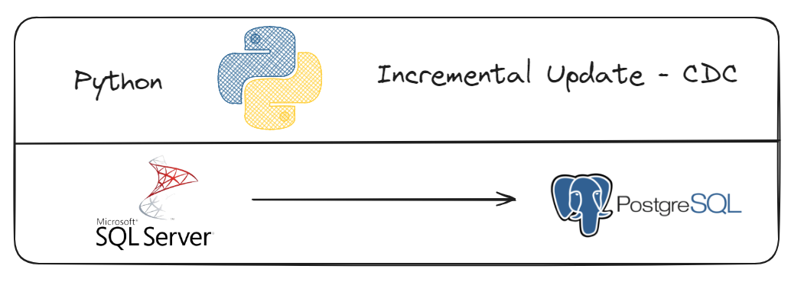

# CDC - Incremental Update with Python

 


## About 

This project aims to implement Change Data Capture (CDC) techniques with Python to perform incremental data updates from a SQL Server database to a PostgreSQL database. Change Data Capture is a method used to track changes in a database, allowing for efficient synchronization of data between different database systems.

## Getting Started <a name = "getting_started"></a>

Clone the project to your machine.
```
git clone https://github.com/wlcamargo/python_cdc
```

### Installing
To set up your development environment, follow these steps:

1. Set up the virtual environment (optional but recommended):

    Windows:
    
    ```
    python -m venv venv
    venv\Scripts\activate
    ```

    Linux:
    
    ```
    python -m venv venv
    source venv/bin/activate
    ```

2. Install dependencies:

    ```
    pip install -r requirements.txt
    ```

## Tutorial 


## Developer 

[Wallace Camargo](https://www.linkedin.com/in/wallace-camargo-35b615171/) 

## References 
https://www.youtube.com/@BiInsightsInc